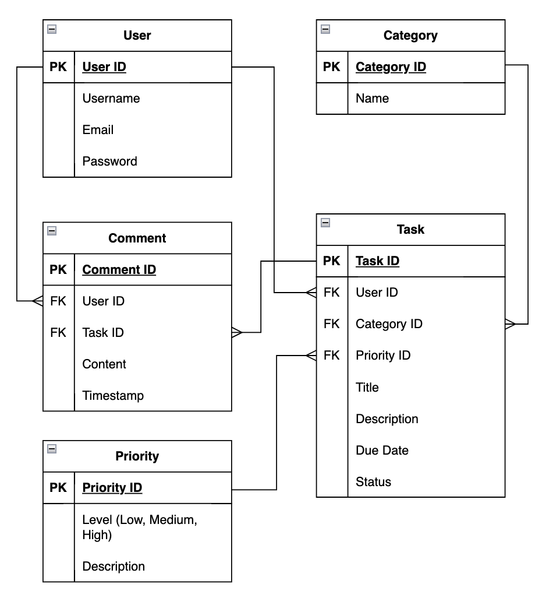
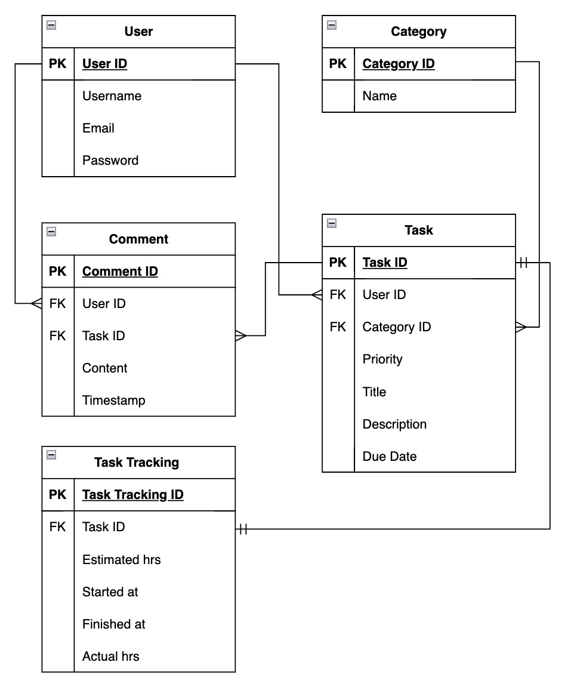

# API Web Server Application: Task Manager 

### R1: Explain the problem that this app will solve, and explain how this app solves or addresses the problem. 

The task management system I have developed targets the prevalent inefficiencies and organizational challenges in task management. Many individuals and teams resort to using a mix of tools such as spreadsheets, emails, and messaging apps, leading to disorganised workflows. This fragmentation causes lost time, missed deadlines, and insufficient accountability, severely impacting productivity and project outcomes. According to a survey by McKinsey, employees spend nearly 20% of their time searching for internal information or tracking down colleagues for help, highlighting the inefficiencies in current task management practices (Chui et al., 2012). 

Effective task management is essential for maintaining productivity in both individual and team settings. However, the lack of a unified system presents several problems. One is that inefficiency arises from fragmented workflows caused by using multiple tools, which increases the time and effort required to manage tasks. Research from the Harvard Business Review indicates that employees waste significant time transitioning between different applications, which can reduce productivity by up to 40% (Cross, 2024). 

The proposed task management system offers a centralised platform for managing tasks, including creating, updating, categorising, prioritising, and commenting. This system ensures all task-related information is consolidated and easily accessible, thereby reducing administrative overhead and improving efficiency. Key features include user management for handling registrations and profiles, task management for various task operations, category management for organisation, priority management for setting task importance, and comment management for collaboration.

#### **_Issue: Missed Deadlines_**
Missed deadlines are often the result of poor task tracking and prioritisation. The task management system solves this by providing a task feature that allows users to create, update, and manage tasks with clear deadlines. Each task can have a specified due date, visible to all relevant team members, ensuring that progress is monitored, and reminders are set to alert team members of approaching deadlines. This proactive approach minimises the risk of tasks slipping through the cracks.

#### **_Issue: Inefficiency from Fragmented Workflows_**
Fragmented workflows occur when task-related information is scattered across various tools and platforms, causing inefficiencies and wasted time. The task management system consolidates all task-related activities into one platform, ensuring that all information is easily accessible. The category feature allows tasks to be organised into different categories, making it easier to manage and locate them. Moreover, the priority feature ensures that tasks are prioritised based on their importance, allowing team members to focus on high-priority tasks first.

#### **_Issue: Lack of Accountability_**
Accountability suffers when there is no clear assignment of tasks or tracking of progress. The user management feature addresses this by handling user registrations and profiles, ensuring secure and personalised access. Tasks can be assigned to specific individuals, ensuring clear responsibility. The comment management feature enhances accountability further by allowing users to add comments and updates to tasks, ensuring transparency and real-time communication about task status and changes.

### R2: Describe the way tasks are allocated and tracked in your project.

For the creation of the task manager API, I used a Trello board to manage and track tasks efficiently.

The Trello board can be viewed here: [T2A2 - API Webserver](https://trello.com/invite/b/66a620e794c68b2ad3de7be6/ATTI400188fb43ee1caa4e46d3c82e0581a02B8A121B/task-manager) 

#### **_Task Allocation_**
I organised the board into four lists, each representing different stages of task progression:
 1. To-Do: Planning: Tasks that require initial planning and preparation.
 2. In Progress: Tasks that are currently being worked on.
 3. Blocked: Tasks that are stalled due to unresolved issues.
 4. Done: Tasks that have been completed.

#### **_Tracking Tasks_**
Each task is represented as a card on the Trello board. These cards include detailed checklists to break down high-level tasks into smaller, manageable subtasks. Examples of these cards are:
 - Project Conception and Setup: Contains checklists for all stages of project conception, approval, and initial setup.
 - Documentation Requirements: Breaks down documentation tasks into detailed steps.
 - Flask Application Setup: Includes tasks for creating key configuration and setup files for the Flask application.
 - Key Features Development: Cards for developing models, schemas, controllers, and CLI commands.

#### **_Task Progression_**
When a task begins, it is moved from the relevant To-Do list to the In Progress list. This involves updating checklists regularly, marking items as completed, and using the comments section to document progress and any adjustments needed.

#### **_Accountability and Flexibility_**
As the sole developer on this project, I did not assign cards or checklist items to myself nor set due dates. This flexible approach allowed me to adapt to the project's fluid nature and work on multiple tasks concurrently. In a team setting, task allocation and tracking would involve assigning tasks to team members and setting deadlines. However, even without these elements, maintaining the Trello board was essential for keeping track of progress and ensuring all tasks were documented and organised. This method proved beneficial for resuming work each day, allowing me to quickly review the status of tasks and continue from where I left off.
Using the Trello board, I was able to maintain an organized and efficient workflow, ensuring all tasks were allocated and tracked throughout the project's development. This approach facilitated seamless transitions between work sessions, enabling me to maintain a clear overview of the project's progress.

### R3: List and explain the third-party services, packages and dependencies used in this app.

This application utilises several third-party services, packages, and dependencies to enhance its functionality, security, and manageability. Below is a detailed description of each one used in the developed application:

- **Flask** 
    - Description: Flask is a lightweight WSGI web application framework in Python. It offers tools, libraries, and technologies for building a web application.
    - Usage: In this application, Flask serves as the core framework, handling the creation of the web server, managing HTTP requests, and routing. It provides the foundational structure upon which all other functionalities are built.

- **Flask-JWT-Extended** 
    - Description: This extension adds support for using JSON Web Tokens (JWT) to Flask for authentication and authorization purposes.
    - Usage: This package is utilized to handle user authentication, ensuring that secure endpoints are only accessible to authenticated users. It manages token creation upon user login, token refreshing for maintaining session validity, and token validation for protecting sensitive routes.

 - **SQLAlchemy**
    - Description: SQLAlchemy is a SQL toolkit and Object-Relational Mapping (ORM) library for Python. It provides a comprehensive suite of well-known enterprise-level persistence patterns.
    - Usage: SQLAlchemy is employed for ORM, allowing the application to interact with the database using Python classes and objects. This abstraction simplifies database operations, making it easier to perform CRUD (Create, Read, Update, Delete) operations without writing raw SQL queries.

- **Marshmallow**
    - Description: Marshmallow is a library for converting complex data types, such as objects, to and from native Python data types.
    - Usage: In this application, Marshmallow is used for serialization (converting Python objects to JSON) and deserialization (validating and parsing JSON data into Python objects). This facilitates data exchange between the server and clients, ensuring that data is properly formatted and validated.

- **Flask-Bcrypt** 
    - Description: Flask-Bcrypt is an extension that provides bcrypt hashing utilities for Flask applications.
    - Usage: This package is employed to securely hash and verify user passwords. By using bcrypt, the application ensures that passwords are stored securely, enhancing the overall security of the authentication process.

- **Psycopg2** 
    - Description: Psycopg2 is a PostgreSQL adapter for Python, providing an interface for connecting to and interacting with PostgreSQL databases.
    - Usage: Psycopg2 is the database driver used to connect the Flask application to the PostgreSQL database. It enables the application to perform database operations, ensuring that the backend database is efficiently managed and accessed.

- **Python-dotenv** 
    - Description: python-dotenv is a library that reads key-value pairs from a .env file and can set them as environment variables.
    - Usage: python-dotenv is used to manage configuration settings and sensitive data such as API keys and database URLs. By loading these settings from a .env file, the application can keep environment-specific configurations separate from the codebase, enhancing security and flexibility.

By incorporating these third-party packages, the application gains robust capabilities in terms of web server management, authentication, database interactions, data serialization, and security, ultimately leading to a more efficient and secure development process.

### R4: Explain the benefits and drawbacks of this app’s underlying database system.

The foundation of the application’s data management lies in the robust PostgreSQL database system One of the primary benefits of PostgreSQL is its highly configurable parameters. This adaptability allows users to customize settings to meet the specific needs of their applications. For example, PostgreSQL enables the dynamic adjustment of memory allocation based on server requirements, which enhances its versatility across various use cases. Parameters can be fine-tuned at multiple levels, including session, transaction, and function, providing granular control over database behaviour and optimizing performance (Dhruv et al., 2024). 

Another significant attribute of PostgreSQL is its exceptional extensibility. Unlike many other databases, PostgreSQL permits users to augment its functionality by adding new data types, functions, and languages. This is facilitated through extensions that can be developed and installed as required. For instance, PostgreSQL supports a variety of procedural languages such as PL/pgSQL, PL/Python, and even JavaScript, enabling developers to write functions in their preferred programming languages. This extensibility is crucial for building sophisticated applications that demand customized functionalities (Dhruv et al., 2024).

Furthermore, PostgreSQL is renowned for its robust security features. It incorporates comprehensive built-in security mechanisms and supports additional extensions to further enhance security. PostgreSQL offers both parameter and application-level security. Parameter security allows for the configuration of operating system-level settings to secure the database environment, while application-level security enables the assignment of specific privileges to different user roles, ensuring that only authorized users can access or modify the data. This layered security approach helps safeguard the integrity and confidentiality of the data stored within the database (Dhruv et al., 2024).

However, despite its numerous strengths, PostgreSQL also has certain limitations. One of the primary drawbacks is its performance when handling large datasets. Due to its relational database structure, PostgreSQL may exhibit slower performance when querying extensive tables, as it needs to sequentially read through all rows to locate the relevant data. This can pose a significant challenge in environments with substantial data and complex queries. Additionally, as an open-source database, PostgreSQL may lack some of the user-friendly interfaces and features typically found in proprietary databases. This can lead to compatibility issues or necessitate specialized software or hardware to operate effectively. Furthermore, the absence of a single governing entity for PostgreSQL implies that support and updates rely on the community, which might not always align with the needs of all users (Dhruv et al., 2024).

Despite these drawbacks, PostgreSQL remains a powerful and versatile database system. Its open-source nature, combined with its extensive feature set and configurability, makes it a popular choice among developers and administrators. PostgreSQL provides a secure, extensible, and adaptable environment for managing data, irrespective of the size or complexity of the dataset. 

### R5: Explain the features, purpose and functionalities of the object-relational mapping system (ORM) used in this app. 

Object-Relational Mapping (ORM) provides a systematic approach to bridge the gap between object-oriented programming languages and relational databases. ORM facilitates the seamless conversion of objects into database-storable elements, enabling efficient data retrieval in the future. By mapping objects to relational data tables, ORM ensures that any changes made to an object are immediately reflected in the database, thereby maintaining data integrity. This system alleviates the need for developers to constantly modify code to accommodate interface changes, thus promoting code stability and ease of maintenance. Moreover, ORM enhances team collaboration by making the database structure more understandable without extensive code review, thereby simplifying the process of deriving insights from complex states and codes generated by object-oriented programs (Oppermann (2023). 

SQLAlchemy, the ORM used in this application, is composed of two primary components: the Core and the ORM. The Core is a comprehensive SQL abstraction toolkit that offers a high level of abstraction over various DBAPI implementations and behaviours. It includes a SQL Expression Language, which enables the formulation of SQL queries through generative Python expressions. Additionally, the Core features a schema representation system capable of emitting Data Definition Language (DDL) statements and introspecting existing schemas, along with a type system that maps Python types to database types. The ORM component, built atop the Core, allows applications to interact with databases using Python objects, providing an additional layer of abstraction. This dual-component architecture ensures precise and efficient control over database interactions (SQLAlchemy, n.d.).

### **_Key Features of SQLAlchemy ORM_**
- Connection Management: SQLAlchemy excels in managing database connections, ensuring that resources are efficiently utilized and properly released back to the system. It supports concurrent connections to multiple databases, thereby unlocking powerful data manipulation capabilities. The Engine object in SQLAlchemy serves as a source of database connectivity and behaviour, while the Session object acts as the primary interface for transaction management and persistence operations (Datta 2024). 

- ORM Functionality: The ORM component of SQLAlchemy allows developers to work with databases using Python objects. It maps relational database systems to Python objects, enabling developers to perform database operations using Python classes. This ORM is independent of the specific relational database system used, making it easy to switch between different systems with minimal code changes (Datta 2024).

    - The supplied code snippet demonstrates SQLAlchemy's ORM feature by showing how Python classes may be used to construct and manipulate database tables. In this example, the columns designated as class attributes are represented by the User and Task classes as tables in the database. The relationship function creates a bidirectional link between these tables, allowing for easy exploration and manipulation of related objects. With the use of this abstraction, developers may communicate with the database using Pythonic expressions, which eliminates the need for raw SQL queries and makes maintenance and scalability easier.

```
from sqlalchemy import Column, Integer, String, ForeignKey
from sqlalchemy.orm import relationship

class User(Base):
    __tablename__ = 'users'
    id = Column(Integer, primary_key=True)
    name = Column(String)
    tasks = relationship('Task', back_populates='user')

class Task(Base):
    __tablename__ = 'tasks'
    id = Column(Integer, primary_key=True)
    title = Column(String)
    user_id = Column(Integer, ForeignKey('users.id'))
    user = relationship('User', back_populates='tasks')
``` 

- Data Manipulation: SQLAlchemy simplifies interactions with SQL databases by allowing developers to manipulate data as Python objects, making the process more intuitive. It supports advanced data manipulation functions such as filtering, ordering, and grouping, and also enables the execution of raw SQL queries when necessary. This flexibility enhances the efficiency and effectiveness of data manipulation tasks (Datta 2024).

### R6: Design an entity relationship diagram (ERD) for this app’s database and explain how the relations between the diagrammed models will aid the database design. This should focus on the database design BEFORE coding has begun, eg. during the project planning or design phase.



**How the Relationships Aid Database Design**

During the project planning or design phase, these relationships are crucial for the following reasons:

**_1. User to Task Relationship:_**
- Data Integrity: By specifying a one-to-many connection between users and tasks, orphaned tasks are avoided and data integrity is preserved by making sure that every task is associated with a legitimate user.
-	Query Optimization: This relationship enables efficient queries to retrieve all tasks associated with a particular user. For example, SELECT * FROM tasks WHERE user_id = ? can quickly fetch all tasks for a given user.

**_2. User to Comment Relationship:_**
-	Data Integrity: By keeping each comment's accountability and context intact, this connection guarantees that comments are consistently associated with legitimate users.
-	Query Optimization: Enables efficient retrieval of comments made by a user, enhancing the user experience. For instance, SELECT * FROM comments WHERE user_id = ? can fetch all comments by a specific user.

**_3. Category to Task Relationship:_**
- Data Organization: Associating tasks with categories helps in organizing tasks into manageable groups. This is useful for filtering and searching tasks based on their category.
- Query Optimization: Efficient queries can be written to filter tasks by category, such as SELECT * FROM tasks WHERE category_id = ?, which helps in task management and retrieval.

**_4. Task to Comment Relationship:_**
- Collaboration and Tracking: By linking comments to tasks, this relationship facilitates collaboration and tracking of discussions related to each task.
- Query Optimization: Allows for efficient retrieval of all comments associated with a task, e.g., SELECT * FROM comments WHERE task_id = ?, helping in task management and review.

**_5. Priority to Task Relationship:_**
- Task Management: Assigning priorities to tasks helps in distinguishing the importance and urgency of each task, aiding in effective task management.
- Query Optimization: Enables efficient queries to sort or filter tasks based on priority, such as SELECT * FROM tasks WHERE priority_id = ?, which helps users focus on high-priority tasks.

**How the Relationships Aid Database Design**

The database design adheres to the principles of normalization, specifically targeting the Third Normal Form (3NF). This helps in reducing redundancy and maintaining data integrity.

- First Normal Form (1NF): Ensures that each column contains atomic values, and each entry in the column contains only a single value from that attribute's domain. For example, each task's title and description are stored in separate columns with unique values.
- Second Normal Form (2NF): Ensures that all non-key attributes are fully dependent on the primary key. For instance, the attributes in the Task table (such as title, description, due_date, etc.) depend entirely on the task_id.
- Third Normal Form (3NF): Ensures that there are no transitive dependencies; non-key attributes are not dependent on other non-key attributes. For example:
    - User Table: The user's name and email depend solely on user_id.
    - Task Table: Attributes such as title, description, due_date, priority_id, category_id, and user_id all depend solely on task_id.
    - Comment Table: Attributes such as content, timestamp, user_id, and task_id depend solely on comment_id.
    - Category Table: The category name depends solely on category_id.
    - Priority Table: The priority level depends solely on priority_id.

By ensuring that non-key attributes do not depend on other non-key attributes, the design eliminates redundancy and maintains data integrity (Kaula, n.d.). 

**Comparison to Other Levels of Normalization** 
- First Normal Form (1NF): In a less normalized form like 1NF, the database might have redundant information, such as repeated priority levels or category names, leading to increased storage use and potential inconsistencies. For example, if priority levels were stored directly in the Task table without a separate Priority table, each task record would include the text of the priority, leading to redundancy (Kaula, n.d.). 
- Second Normal Form (2NF): In 2NF, while there would be no partial dependency on a composite key, there could still be transitive dependencies. For instance, if the Category name was stored directly in the Task table along with the category_id, it would lead to inconsistencies if the category name changes (Kaula, n.d.). 

By adhering to 3NF in the ERD, the design ensures efficient data management and retrieval, reduces redundancy, and maintains data integrity, making the database robust and scalable.
This structured approach in designing the database, focusing on normalization and clear entity relationships, lays a strong foundation for efficient database implementation and management in subsequent development phases.

### R7: Explain the implemented models and their relationships, including how the relationships aid the database implementation.This should focus on the database implementation AFTER coding has begun, eg. during the project development phase.



In the project development phase, the implemented models and their relationships play a crucial role in creating a robust and efficient database structure. Below is an explanation of the implemented models, their relationships, and how these relationships aid the database implementation.

#### **Users Model:**

- Attributes: The Users model includes id, name, email, and password.
- Relationships:
    - Tasks Relationship:
        - Description: Each user can create multiple tasks, establishing a one-to-many relationship between User and Task.
        - Implementation: This is implemented using the user_id foreign key in the Task model, linked to the id field in the Users model.
        - Back_populates: The relationship uses the back_populates condition, ensuring that changes in one side of the relationship are reflected in the other.
        - Cascade Delete: A "cascade delete" condition ensures that if a user record is deleted, all related tasks are also deleted.
    - Aid to Database Implementation: This relationship allows for efficient tracking of tasks by users. It ensures that all tasks are linked to their respective users, making it easy to retrieve all tasks associated with a user. The cascade delete feature helps maintain data integrity by automatically removing tasks when a user is deleted, preventing orphaned records.

#### **Tasks Model:**
- Attributes: The 'Tasks' model includes 'id', 'title', 'description', 'due_date', 'priority', 'category_id', and 'user_id'.
- Relationships:
    - Users Relationship:
        - Description: Each task is associated with one user
        - Implementation: This is implemented with a foreign key 'user_id' in the 'Tasks' model, linked to the 'id' field in the 'Users' model.
        - Back_populates: This relationship uses the 'back_populates' condition for synchronisation between models.
    - Aid to Database Implementation: By linking tasks to users, this relationship ensures that tasks are correctly assigned and managed by the right users. It facilitates the retrieval of user-specific tasks and enhances user-task management within the application.

    - Comments Relationship:
        - Description: A task can have multiple comments, establishing a one-to-many relationship between 'Task' and 'Comment'.
        - Implementation: This is implemented using the 'task_id' foreign key in the 'Comment' model.
        - Cascade Delete: Ensures that if a task is deleted, all associated comments are also deleted.
    - Aid to Database Implementation: This relationship supports task-specific discussions and feedback. By linking comments to tasks, it ensures that all relevant comments are easily accessible, promoting better communication and collaboration. The cascade delete feature maintains data integrity by removing comments when a task is deleted.

    - Category Relationship:
        - Description: Each task belongs to a single category, establishing a one-to-many relationship between 'Category' and 'Task'.
        - Implementation: This is implemented using the 'category_id' foreign key in the Task model.
        - Back_populates: This relationship uses the 'back_populates' condition.
    - Aid to Database Implementation: Categorising tasks helps in organising and filtering tasks based on categories. This relationship makes it easy to retrieve and manage tasks by category, enhancing task organisation and management.

    - Task Tracking Relationship:
        - Description: Each task has a single task tracking record, establishing a one-to-one relationship between 'Task' and 'TaskTracking'.
        - Implementation: This is implemented using the 'task_id' foreign key in the TaskTracking model.
        - Back_populates: This relationship uses the 'back_populates' condition for synchronization.
    - Aid to Database Implementation: The task tracking relationship enables detailed monitoring of task progress, including estimated and actual hours, start and finish times. This relationship provides critical insights into task performance and helps in tracking the progress and completion of tasks.

#### **Comments Model:** 
- Attributes: The Comments model includes 'id', 'content', 'timestamp', 'user_id', and 'task_id'.
- Relationships:
    - Task Relationship:
        - Description: Each comment is associated with a single task.
        - Implementation: This is implemented using the 'task_id' foreign key in the Comments model.
        - Back_populates: This relationship uses the 'back_populates' condition.
    - Aid to Database Implementation: This relationship ensures that comments are linked to specific tasks, making it easy to retrieve and display task-related comments. It enhances collaboration by providing a platform for users to discuss and provide feedback on tasks.

    - Users Relationship:
        - Description: Each comment is made by a single user.
        - Implementation: This is implemented using the 'user_id' foreign key in the Comments model.
        - Back_populates: This relationship uses the 'back_populates' condition.
    - Aid to Database Implementation: By linking comments to users, this relationship helps in identifying the authors of comments, promoting accountability and transparency in task-related discussions.

#### **Categories Model:**
- Attributes: The 'Categories' model includes 'id' and 'label'.
- Relationships:
    - Tasks Relationship:
        - Description: Each category can include multiple tasks.
        - Implementation: This is implemented using the 'category_id' foreign key in the 'Tasks' model.
        - Back_populates: This relationship uses the 'back_populates' condition.
    - Aid to Database Implementation: Categorising tasks helps in organising and filtering tasks based on categories. This relationship makes it easy to retrieve and manage tasks by category, enhancing task organization and management.

#### **TaskTracking Model:** 
- Attributes: The TaskTracking model includes id, 'task_id', 'estimated_hours', 'actual_hours', 'started_at', and 'finished_at'
- Relationships:
    - Tasks Relationship:
        - Description: Each task has one task tracking entry.
        - Implementation: This is implemented using the 'task_id' foreign key in the TaskTracking model.
        - Back_populates: This relationship uses the 'back_populates' condition, ensuring changes in one side are reflected in the other.
    - Aid to Database Implementation: The task tracking relationship enables detailed monitoring of task progress, including estimated and actual hours, start and finish times. This relationship provides critical insights into task performance and helps in tracking the progress and completion of tasks.

#### **How the Relationships Aid Database Implementation**
- Efficiency and Integrity:
    - Normalisation: The database design follows normalisation principles to reduce redundancy and ensure data integrity. For example, by using foreign keys and separate tables for related entities, we avoid data duplication and maintain consistent and accurate data.
    
    - Back_populates: The use of 'back_populates' ensures that related objects are kept in sync, making data manipulation easier and more intuitive. This bidirectional relationship allows for easy access and updates to related data from either side of the relationship.
    
    - Cascade Delete: This feature ensures that deleting a record also removes all related records, maintaining referential integrity and preventing orphan records. For example, deleting a user will also delete all tasks and comments associated with that user.

- Improvement over Priority Table:
    - Functionality: Replacing the 'Priority' table with the 'TaskTracking' table enhances functionality by providing detailed tracking of task progress, including estimated and actual hours, start and finish times.
    
    - Usefulness: This change makes the system more useful for managing tasks by enabling better monitoring and reporting on task progress, which was not possible with the 'Priority' table.

By implementing these models and relationships, the database structure is robust, maintainable, and scalable, providing a solid foundation for the application during and after development. The relationships ensure efficient data management, facilitate collaboration and communication, and provide detailed insights into task performance and progress.

### R8: Explain how to use this application’s API endpoints

**Endpoint #1 - Register User:**
- Route: /auth/register
- Purpose: Allows new users to register for the app
- HTTP Request Method: POST
- Required Data:
    - Body: JSON object containing:
    ```
    {
    "name": "string",
    "email": "string",
    "password": "string"
    }
    ```
    - Email must be unique and meet regex conditions
    - Password must be at least 8 characters in length
- Expected Response Data:
    - Success: JSON object with the user's email and user_id
    - Errors:
        - IntegrityError for missing fields or non-unique email
        - ValidationError for invalid email or password format
- Authentication Methods: None

**Endpoint #2 - Login User:** 
- Route: /auth/login
- Purpose: Allows existing users to login and obtain a JWT token for authenticated tasks
- HTTP Request Method: POST
- Required Data:
    - Body: JSON object containing:
    ```
    {
    "email": "string",
    "password": "string"
    }
    ```
- Expected Response Data:
    - Success: JSON object with the user's email and JWT token
    - Errors:
        - Invalid email or password
        - Missing email or password fields
- Authentication Methods: None

**Endpoint #3 - Update User:**
- Route: /auth/users
- Purpose: Allows a user to update their own name and/or password
- HTTP Request Method: PUT, PATCH
- Required Data:
    - Header: Authorisation: Bearer <JWT_TOKEN>
    - Body: JSON object containing:
    ```
    {
    "name": "string",
    "password": "string"
    }
    ```
- Expected Response Data:
    - Success: JSON object with the updated user's data
    - Errors:
        - User not found
- Authentication Methods:
    - Requires a valid JWT token to confirm the user_id of the logged-in user

**Endpoint #4 - Get All Tasks:**
- Route: /tasks
- Purpose: Fetch all tasks in descending order of due date
- HTTP Request Method: GET
- Required Data:
    - Header: Authorisation: Bearer <JWT_TOKEN>
- Expected Response Data:
    - Success: JSON array of all tasks
    - Errors: 
        - Unauthorized access
- Authentication Methods: 
    - Requires a valid JWT token 

**Endpoint #5 - Get One Task:** 
- Route: /tasks/int:task_id
- Purpose: Fetch a single task by its ID
- HTTP Request Method: GET
- Required Data:
    -  Header: Authorisation: Bearer <JWT_TOKEN> 
- Expected Response Data:
    - Success: JSON object of the task data
    - Errors:
        - Task not found
        - Unauthorised access 
- Authentication Methods:
    - Requires a valid JWT token 

**Endpoint #6 - Create Task:**
- Route: /tasks
- Purpose: Create a new task with the provided data
- HTTP Request Method: POST
- Required Data:
    - Header: Authorisation: Bearer <JWT_TOKEN>
    - Body: JSON object containing:
    ```
    {
    "title": "string",
    "description": "string",
    "priority": "string",
    "category": {
        "label": "string"
     }
    }
    ```
- Expected Response Data:
    - Success: JSON object of the created task
    - Errors:
        - Missing or invalid category label
        - Unauthorised access

- Authentication Methods:
    - Requires a valid JWT token

**Endpoint #7 - Delete Task:** 
- Route: /tasks/int:task_id
- Purpose: Delete a task by its ID
- HTTP Request Method: DELETE
- Required Data:
    - Header: Authorisation: Bearer <JWT_TOKEN>
- Expected Response Data:
    - Success: Success message
    - Errors:
        - Task not found
        - Unauthorised user
- Authentication Methods:
    - Requires a valid JWT token

**Endpoint #8 - Update Task:**
- Route: /tasks/int:task_id
- Purpose: Update a task by its ID with the provided data
- HTTP Request Method: PUT, PATCH
- Required Data:
    - Header: Authorisation: Bearer <JWT_TOKEN>
    - Body: JSON object containing:
    ```
    {
    "title": "string",
    "description": "string",
    "priority": "string"
    }
    ```
- Expected Response Data:
    - Success: JSON object of the updated task
    - Errors:
        - Task not found
        - Unauthorised user
- Authentication Methods:
    - Requires a valid JWT token

**Endpoint #9 - Create Task Tracking:**
- Route: /tasks/int:task_id/task_trackings
- Purpose: Create a new task tracking record for a specific task
- HTTP Request Method: POST
- Required Data:
    - Header: Authorisation: Bearer <JWT_TOKEN>
    - Body: JSON object containing:
    ```
    {
    "estimated_hours": "float",
    "started_at": "string (DD/MM/YY HH:MM)",
    "finished_at": "string (DD/MM/YY HH:MM)"
    }
    ```
- Expected Response Data:
    - Success: JSON object of the created task tracking record
    - Errors:
        - Task not found
        - Invalid date format
        - Unauthorised access
- Authentication Methods:
    - Requires a valid JWT token

**Endpoint #10 - Update Task Tracking:**
- Route: /tasks/int:task_id/task_trackings/int:tracking_id
- Purpose: Update an existing task tracking record for a specific task
- HTTP Request Method: PATCH, PUT
- Required Data:
    - Header: Authorisation: Bearer <JWT_TOKEN>
    - Body: JSON object containing:
    ```
    {
    "estimated_hours": "float",
    "started_at": "string (DD/MM/YY HH:MM)",
    "finished_at": "string (DD/MM/YY HH:MM)"
    }
    ```
- Expected Response Data:
    - Success: JSON object of the updated task tracking record
    - Errors:
        - Task tracking record not found
        - Invalid date format
        - Unauthorised access
- Authentication Methods:
    - Requires a valid JWT token

**Endpoint #11 - Get Task Trackings:**
- Route: /tasks/int:task_id/task_trackings
- Purpose: Fetch all task tracking records for a specific task
- HTTP Request Method: GET
- Required Data:
    - Header: Authorisation: Bearer <JWT_TOKEN>
- Expected Response Data:
    - Success: JSON array of task tracking records
    - Errors:
        - No task tracking records found
        - Unauthorised access
- Authentication Methods:
    - Requires a valid JWT token

**Endpoint #12 - Delete Task Tracking:**
- Route: /tasks/int:task_id/task_trackings/int:tracking_id
- Purpose: Delete a task tracking record for a specific task
- HTTP Request Method: DELETE
- Required Data:
    - Header: Authorisation: Bearer <JWT_TOKEN>
- Expected Response Data:
    - Success: Success message
    - Errors:
        - Task tracking record not found
        - Unauthorised access
- Authentication Methods:
    - Requires a valid JWT token

**Endpoint #13 - Create Comment:**
- Route: /tasks/int:task_id/comments
- Purpose: Create a new comment for a specific task
- HTTP Request Method: POST
- Required Data:
    - Header: Authorisation: Bearer <JWT_TOKEN>
    - Body: JSON object containing:
    ```
    {
    "content": "string"
    }
    ```
- Expected Response Data:
    - Success: JSON object of the created comment
    - Errors:
        - Validation error
        - Task not found
        - Unauthorised access
- Authentication Methods:
    - Requires a valid JWT token

**Endpoint #14 - Delete Comment:**
- Route: /tasks/int:task_id/comments/int:comment_id
- Purpose: Delete a comment by its ID
- HTTP Request Method: DELETE
- Required Data:
    - Header: Authorisation: Bearer <JWT_TOKEN>
- Expected Response Data:
    - Success: Success message
    - Errors:
        - Task or comment not found
- Authentication Methods:
    - Requires a valid JWT token

**Endpoint #15 - Update Comment:**
- Route: /tasks/int:task_id/comments/int:comment_id
- Purpose: Update a comment by its ID
- HTTP Request Method: PUT, PATCH
- Required Data:
    - Header: Authorization: Bearer <JWT_TOKEN>
    - Body: JSON object containing:
    ```
    {
    "content": "string"
    }
    ```
- Expected Response Data:
    - Success: JSON object of the updated comment
    - Errors:
        - Validation error
        - Task or comment not found
- Authentication Methods:
    - Requires a valid JWT token

**Endpoint #16 - Fetch Tasks by Category:**
- Route: /categories/int:category_id/tasks
- Purpose: Fetch tasks for a specific category
- HTTP Request Method: GET
- Required Data: None
- Expected Response Data:
    - Success: JSON array of tasks in the specified category
    - Errors:
        - No tasks found for the specified category
- Authentication Methods: None

**Endpoint #17 - Fetch All Categories:**
- Route: /categories
- Purpose: Fetch all categories
- HTTP Request Method: GET
- Required Data: None
- Expected Response Data:
    - Success: JSON array of all categories
- Authentication Methods: None

**Endpoint #18 - Fetch One Category:**
- Route: /categories/int:category_id
- Purpose: Fetch a single category by its ID
- HTTP Request Method: GET
- Required Data: None
- Expected Response Data:
    - Success: JSON object of the category data
    - Errors:
        - Category not found
- Authentication Methods: None

**Endpoint #19 - Create Category:**
- Route: /categories/tasks/int:task_id/categories
- Purpose: Create a new category and assign it to a task
- HTTP Request Method: POST
- Required Data:
    - Header: Authorisation: Bearer <JWT_TOKEN>
    - Body: JSON object containing:
    ```
    {
    "label": "string"
    }
    ```
- Expected Response Data:
    - Success: JSON object of the created category
    - Errors:
        - Validation error
        - Task not found
- Authentication Methods:
    - Requires a valid JWT token

**Endpoint #20 - Delete Category:**
- Route: /categories/int:category_id
- Purpose: Delete a category by its ID
- HTTP Request Method: DELETE
- Required Data:
    - Header: Authorisation: Bearer <JWT_TOKEN>
- Expected Response Data:
    - Success: Success message
    - Errors:
        - Category not found
- Authentication Methods:
    - Requires a valid JWT token

**Endpoint #21 - Edit Category:**
- Route: /categories/int:category_id
- Purpose: Edit an existing category by its ID
- HTTP Request Method: PATCH, PUT
- Required Data:
    - Header: Authorisation: Bearer <JWT_TOKEN>
    - Body: JSON object containing:
    ```
    {
    "label": "string"
    }
    ```
- Expected Response Data:
    - Success: JSON object of the updated category
    - Errors:
        - Validation error
        - Category not found
- Authentication Methods:
    - Requires a valid JWT token

### References: 
- Chui, M., Manyika, J., Bughin, J., Dobbs, R., Roxburgh, C., Sarrazin, H., Sands, G., & Westergren, M. (2012). The social economy: Unlocking value and productivity through social technologies. In McKinsey & Company. https://www.mckinsey.com/industries/technology-media-and-telecommunications/our-insights/the-social-economy 
- Cross, R. (2024, March 19). Collaborative Overload. Harvard Business Review. https://hbr.org/2016/01/collaborative-overload 
- Oppermann, A. (2023, September 26). What Is Object-Relational Mapping (ORM)? Built In. https://builtin.com/data-science/object-relational-mapping
- SQLAlchemy. (n.d.). https://www.sqlalchemy.org/features.html  
- Datta, D. (2024, March 28). What is SQLAlchemy Used For? An Overview with Practical Examples. CData Software. https://www.cdata.com/blog/what-is-sqlalchemy#:~:text=Core%20functionalities%20of%20SQLAlchemy&text=SQLAlchemy
- Dhruv, S., Dhruv, S., & Dhruv, S. (2024, July 12). PostgreSQL Advantages and Disadvantages. Aalpha. https://www.aalpha.net/blog/pros-and-cons-of-using-postgresql-for-application-development/ 
- Kaula, V. (n.d.). Normalizing with Entity Relationship Diagramming. TDAN.com. https://tdan.com/normalizing-with-entity-relationship-diagramming/4583 


